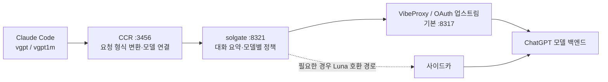

<div align="center">

# solgate


**Claude Code에서 GPT-6 Astra와 GPT-5.6 Sol·Terra·Luna를 사용합니다.**<br>
모델 선택, 긴 대화 요약, 대체 모델 표시를 제공하는 로컬 게이트웨이입니다.

[English](README.md) · [설치·운영 가이드](docs/GUIDE.md) · [변경 기록](CHANGELOG.md)

[](https://github.com/VoidLight00/solgate/actions/workflows/ci.yml)   

</div>

## Astra 시작하기

```bash
vgpt astra          # Astra — Claude Code에 220k 자동 요약 시점 명시
vgpt1m astra        # Astra — solgate가 긴 대화를 요약하며 관리
```

Astra 실행기는 Claude Code와 solgate 양쪽에서 메인 모델의 자동 전환을 끕니다. 일반·가상 Astra 프로세스에 `CLAUDE_CODE_NO_MODEL_FALLBACK=1`을 설정해, 업스트림 오류를 재시도하다가 클라이언트가 Opus 별칭(Sol)으로 바꾸는 경로도 막습니다. 오류는 그대로 오류로 표시합니다. 이전 대화 요약은 Terra, 다음 후보로 Luna를 사용하며 메인 응답 모델은 바뀌지 않습니다.

기존 기본값도 유지됩니다. `vgpt`는 Sol로 시작하며, Claude Code의 작업자 별칭은 Opus → Sol, Sonnet → Terra, Haiku → Luna입니다.

## 설치

**macOS, Node.js 20+, [Claude Code CLI](https://claude.com/claude-code), [claude-code-router](https://github.com/musistudio/claude-code-router) (`ccr`), 실행 중인 ChatGPT OAuth 업스트림**이 필요합니다. VibeProxy 등의 업스트림에 먼저 로그인하고 사용할 모델이 목록에 있는지 확인해 주세요. 기본 주소는 `http://127.0.0.1:8317`입니다.

```bash
git clone https://github.com/VoidLight00/solgate.git
cd solgate
./setup.sh install
source ~/.zshrc
vgpt astra
```

설치기는 전제조건을 확인하고, macOS launchd 서비스 등록 → CCR provider 병합 → 셸 함수 설치 → CCR를 통과하는 소형 요청 확인을 진행합니다. 호환성 검사에서 지원 대상 Luna 업스트림 버그를 발견한 경우에만 사이드카를 설치합니다. 기존 CCR provider는 보존합니다. 현재 Linux·Windows 설치는 지원하지 않습니다.

```bash
./setup.sh doctor
./setup.sh install --upstream http://127.0.0.1:PORT
./setup.sh uninstall
```

업데이트와 기존 사용자 정의 래퍼의 처리는 [가이드](docs/GUIDE.md#설치와-업데이트)를 참고해 주세요.

## 모델 선택

| 명령 | 메인 모델 | 대화 길이 관리 |
|---|---|---|
| `vgpt astra` | GPT-6 Astra | 클라이언트에 220k 자동 요약 시점 명시 |
| `vgpt1m astra` 또는 `vgpt astra1m` | GPT-6 Astra | solgate가 이전 대화를 요약 |
| `vgpt` 또는 `vgpt sol` | GPT-5.6 Sol | 기존 `[330k]` 클라이언트 설정 |
| `vgpt terra` | GPT-5.6 Terra | 기존 `[330k]` 클라이언트 설정 |
| `vgpt luna` | GPT-5.6 Luna | 기존 `[330k]` 클라이언트 설정 |
| `vgpt1m` | GPT-5.6 Sol | solgate가 이전 대화를 요약 |
| `vgpt terra1m` | GPT-5.6 Terra | solgate가 이전 대화를 요약 |
| `vgpt luna1m` | GPT-5.6 Luna | solgate가 이전 대화를 요약 |

설치된 명령 목록은 `vgpt models`에서 확인하실 수 있습니다. 가상 세션의 Opus/Sonnet/Haiku 선택 슬롯은 각각 Sol/Terra/Luna의 가상 모델을 사용하며, 일반 세션은 기존 클라이언트 설정을 유지합니다. Astra 선택은 메인 모델만 바꾸며 작업자 분담은 유지합니다.

이미 실행 중인 프로세스에는 새 설정이 적용되지 않습니다. 업데이트한 뒤 기존 작업 폴더에서 다시 시작해 대화를 이어갑니다.

```bash
source ~/.zshrc
vgpt1m astra --resume SESSION_ID
# 또는 같은 폴더의 가장 최근 대화를 이어갑니다.
vgpt1m astra --continue
```

일반 Astra는 위 명령의 `vgpt1m astra` 대신 `vgpt astra`를 사용합니다. `/model`만으로는 시작 시 환경 설정이 적용되지 않습니다. 클라이언트 자동 전환 차단은 해당 프로세스가 끝날 때까지 유지되며, 수동으로 다른 모델을 골라도 풀리지 않습니다. solgate 자체의 모델별 정책은 계속 적용됩니다.

## 가상 1M의 의미

**이전 대화를 요약해 이어가는 기능이며, 원문 100만 토큰을 한 번에 읽는 기능은 아닙니다.** 오래된 턴은 요약으로 바뀌고 최근 턴은 예산 안에서 원문으로 유지합니다. 요약 과정에서 세부 정보가 사라질 수 있습니다.

| 가상 모델 | 요약 시작 추정치* | 최근 원문 유지* | 전송 추정 상한* | 요약 모델 | 메인 응답 자동 전환 |
|---|---:|---:|---:|---|---|
| Astra | 220k 초과 | 약 140k | 240k | Terra → Luna | 없음 |
| Sol | 300k 초과 | 약 200k | 330k | Terra → Luna | Terra → Luna |
| Terra | 300k 초과 | 약 200k | 330k | Luna → Sol | 없음 |
| Luna | 300k 초과 | 약 200k | 330k | Terra → Sol | Terra → Sol |

\* 로컬에서 추정한 기본 예산이며 업스트림의 실제 수용량을 보장하지 않습니다. 도구 정의도 상한에 포함합니다. 전역 설정이 더 작으면 Astra에도 작은 값을 적용합니다. 업스트림이 가상 요청의 문맥 길이를 거부하면 최대 3회 더 줄여서 재시도합니다.

일반 Astra 세션은 `--autocompact 220k`를 명시합니다. `[240k]` 라벨 자체가 모델의 실제 수용량을 증명하지는 않습니다. 이 OAuth 경로에서 Astra 확장 문맥 창이 작동한다는 증거는 아직 없습니다.

## 연결 구조



게이트웨이에서 Sol·Luna는 사용량 한도나 인증 불가 오류가 발생하면 정해진 후보로 전환하며, Terra·Astra는 선택한 모델의 오류를 반환합니다. Astra 실행기는 Claude Code 내부의 별도 자동 전환도 끕니다. 게이트웨이 자동 전환 시 응답 첫머리에 다음과 같은 안내가 붙습니다.

```text
[solgate fallback] gpt-5.6-sol → gpt-5.6-terra (...)
```

자동 전환은 계정 한도를 우회하지 않습니다. 사용 가능 여부와 한도는 업스트림 계정·플랜에 따릅니다. solgate는 독립 프로젝트이며 OpenAI·Anthropic의 공식 연동 제품이 아닙니다.

## 검증과 상태 확인

```bash
bash gates/ci_gate.sh .                            # 모델 호출 없는 mock·정적 검사
SOLGATE_SKIP_BIG=1 bash gates/verify_solgate.sh .   # 대형 문맥을 제외한 live 검사
bash gates/verify_solgate.sh .                    # 약 330k Sol 요약 검사를 포함한 전체 검사
curl http://127.0.0.1:8321/solgate/stats
```

CI 배지는 모델 호출 없는 검사 범위만 나타냅니다. Live 검사는 실행 중인 서비스와 사용 가능한 계정이 필요하며 모델 사용량을 소비합니다. 대형 검사를 건너뛰면 해당 동작은 미검증입니다. Astra의 모델 유지·요약 경계·도구 예산·전송 상한은 mock으로 검사하며, 네이티브 최대 문맥이나 장문 요약 품질을 증명하지는 않습니다.

[검증 범위와 문제 해결](docs/GUIDE.md#검증-범위), [요구사항](REQUIREMENTS.md), [실패 기록](FAILURE_LOG.md), [구현 이력](docs/BACKLOG.md)을 함께 제공합니다.

## 라이선스

MIT © 2026 — [LICENSE](LICENSE)
