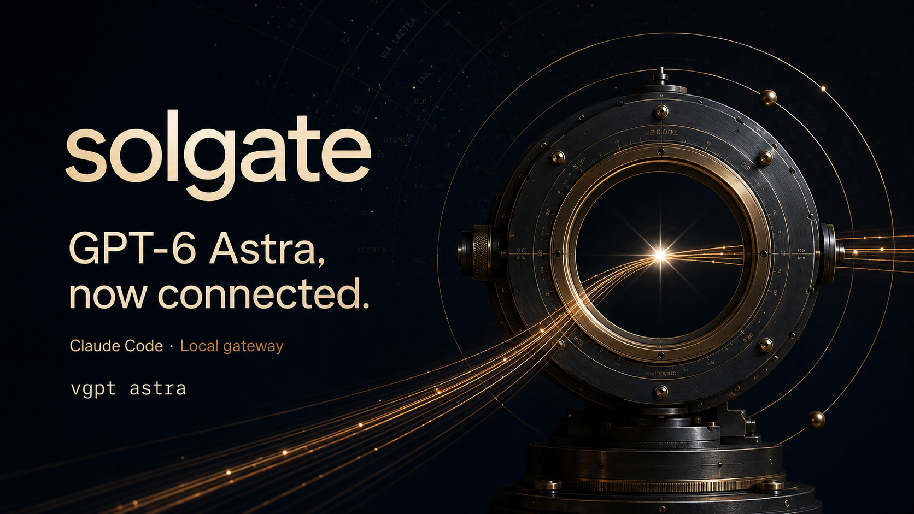
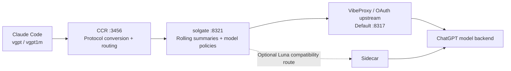

<div align="center">

# solgate



**GPT-6 Astra and GPT-5.6 Sol, Terra, and Luna in Claude Code.**<br>
A local gateway with explicit model selection, rolling context, and visible model fallback.

[한국어](README.ko.md) · [Setup & operations guide](docs/GUIDE.md) · [Changelog](CHANGELOG.md)

[](https://github.com/VoidLight00/solgate/actions/workflows/ci.yml)   

</div>

## Start with Astra

```bash
vgpt astra          # Astra, with Claude Code auto-compaction at 220k
vgpt1m astra        # Astra with server-managed rolling context
```

The Astra launchers disable automatic main-model fallback in both Claude Code and solgate. They set `CLAUDE_CODE_NO_MODEL_FALLBACK=1` for regular and virtual Astra processes, so client-side retries cannot switch an upstream error to the Opus alias (Sol). Errors remain errors. Rolling summaries still use Terra, then Luna, without changing the main response model.

Existing defaults stay the same: `vgpt` starts Sol, and the Claude Code worker aliases remain Opus → Sol, Sonnet → Terra, and Haiku → Luna.

## Install

Requires **macOS, Node.js 20+, [Claude Code CLI](https://claude.com/claude-code), [claude-code-router](https://github.com/musistudio/claude-code-router) (`ccr`), and a running ChatGPT OAuth upstream** such as VibeProxy. Sign in to the upstream first and confirm it exposes the models you intend to use. The default upstream is `http://127.0.0.1:8317`.

```bash
git clone https://github.com/VoidLight00/solgate.git
cd solgate
./setup.sh install
source ~/.zshrc
vgpt astra
```

The installer checks prerequisites, registers a macOS launchd service, merges the solgate provider into CCR, installs the shell functions, and checks a small request through CCR. It adds a Luna sidecar only when its compatibility probe detects the supported upstream bug. Existing CCR providers are preserved. Linux and Windows installation are not currently supported.

```bash
./setup.sh doctor
./setup.sh install --upstream http://127.0.0.1:PORT
./setup.sh uninstall
```

For updates and existing custom wrappers, see the [guide](docs/GUIDE.md#설치와-업데이트).

## Choose a model

| Command | Main model | Context handling |
|---|---|---|
| `vgpt astra` | GPT-6 Astra | Explicit client auto-compaction at 220k |
| `vgpt1m astra` or `vgpt astra1m` | GPT-6 Astra | Rolling summaries managed by solgate |
| `vgpt` or `vgpt sol` | GPT-5.6 Sol | Existing `[330k]` client configuration |
| `vgpt terra` | GPT-5.6 Terra | Existing `[330k]` client configuration |
| `vgpt luna` | GPT-5.6 Luna | Existing `[330k]` client configuration |
| `vgpt1m` | GPT-5.6 Sol | Rolling summaries managed by solgate |
| `vgpt terra1m` | GPT-5.6 Terra | Rolling summaries managed by solgate |
| `vgpt luna1m` | GPT-5.6 Luna | Rolling summaries managed by solgate |

Run `vgpt models` for the installed command list. In a virtual session, the Opus/Sonnet/Haiku picker slots use the corresponding Sol/Terra/Luna virtual profiles. In a regular session, they retain their existing client configurations. Astra changes the main model, not those worker assignments.

Existing processes do not receive the new fallback setting. After updating, resume from the original working directory:

```bash
source ~/.zshrc
vgpt1m astra --resume SESSION_ID
# Or resume the latest conversation in this directory:
vgpt1m astra --continue
```

Use `vgpt astra` instead for a regular Astra session. `/model` alone does not apply startup environment settings. Client fallback stays disabled for the lifetime of the launched process, even if you manually select another model; solgate's own model policies still apply.

## What “virtual 1M” means

**It is a summary-based conversation layer, not a native one-million-token window.** Older turns become summaries; recent turns remain verbatim when they fit the budget. Details can be lost during summarization.

| Virtual profile | Summarize above* | Keep recent* | Estimated send ceiling* | Summary models | Main-response fallback |
|---|---:|---:|---:|---|---|
| Astra | 220k | ~140k | 240k | Terra → Luna | None |
| Sol | 300k | ~200k | 330k | Terra → Luna | Terra → Luna |
| Terra | 300k | ~200k | 330k | Luna → Sol | None |
| Luna | 300k | ~200k | 330k | Terra → Sol | Terra → Sol |

\* These are local token estimates and default budgets, not guaranteed upstream capacities. Tool definitions count toward the ceiling. Smaller global settings also constrain Astra. If the upstream rejects a virtual request as too large, solgate can shrink it and retry up to three times.

For regular Astra sessions, the launcher explicitly passes `--autocompact 220k`; the `[240k]` model label is not treated as proof of native capacity. An expanded Astra window has not been established for this OAuth route.

## How it connects



At the gateway layer, Sol and Luna can switch models when the upstream reports a usage limit or unavailable authentication; Terra and Astra return the selected model's error. Astra launchers also disable Claude Code's separate client fallback. When gateway fallback occurs, the response starts with a notice such as:

```text
[solgate fallback] gpt-5.6-sol → gpt-5.6-terra (...)
```

Fallback does not bypass account limits. Availability and usage remain subject to the upstream account and plan. This is an independent project, not an official OpenAI or Anthropic integration.

## Verify and inspect

```bash
bash gates/ci_gate.sh .                            # Portable mocks + static checks; no model calls
SOLGATE_SKIP_BIG=1 bash gates/verify_solgate.sh .   # Live checks, excluding the large-context test
bash gates/verify_solgate.sh .                    # Full checks, including a ~330k Sol compaction test
curl http://127.0.0.1:8321/solgate/stats
```

The CI badge covers the portable suite. Live gates require configured services and account availability, and consume model usage. Skipping the large-context test leaves that behavior unverified. Astra boundary tests cover model retention, compaction thresholds, tool budgets, and request ceilings with mocks; they do not establish a maximum native window or long-context summary quality.

See [verification scope and troubleshooting](docs/GUIDE.md#검증-범위), [requirements](REQUIREMENTS.md), [failure records](FAILURE_LOG.md), and the [implementation history](docs/BACKLOG.md).

## License

MIT © 2026 — [LICENSE](LICENSE)
