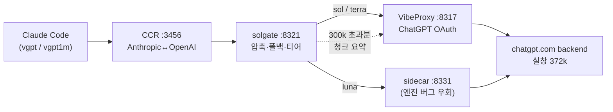

<div align="center">

# solgate


ChatGPT 구독(OAuth)으로 Claude Code에서 GPT-5.6 sol/terra/luna를 풀컨텍스트로 쓰는 로컬 게이트웨이.
가상 1M 컨텍스트(롤링 요약) · 쿼터 자동 폴백(+문구 노출) · 서브에이전트 모델 티어.

     

</div>

---

## 무엇을 하는가

- **가상 1M 컨텍스트** — gpt-5.6-sol의 실창은 input 372k다. solgate는 300k 초과 대화의 오래된 구간을 청크 롤링 요약(캐시 포함)으로 접고 최근 ~200k를 원문 유지해 체감 1M 세션을 만든다. 물리 창을 늘리는 게 아니라 압축 계층이다 — 오래된 턴은 요약본이 된다.
- **쿼터 자동 폴백 + 문구 노출** — 사용량 한도(429)·쿨다운 시 sol은 terra→luna, luna는 terra→sol 순으로 자동 전환하고 응답 첫머리에 대체 모델을 표시한다. 명시적으로 선택한 terra worker route는 sticky라 실패를 다른 모델로 숨기지 않는다.
- **서브에이전트 모델 티어** — Claude Code의 Agent/Workflow 별칭이 `opus`=sol, `sonnet`=terra, `haiku`=luna로 풀린다. 메인은 sol로, 워커는 가볍게.
- **fail-closed 천장** — 어떤 경로로도 모델 실창(372k)을 초과해 전송하지 않는다. tools 정의 토큰까지 차감해 마진을 지키며, 업스트림이 추정 오차로 `context_too_large`를 반환하면 직전 실제 전송량 기준으로 최대 3회 더 줄인다.

폴백이 일어나면 대화에 이렇게 보인다:

```
[solgate fallback] gpt-5.6-sol → gpt-5.6-terra (gpt-5.6-sol: usage_limit_reached, gpt-5.6-sol 리셋 ~11:42)
```

## Quick Start

전제: macOS · Node 20+ · [Claude Code CLI](https://claude.com/claude-code) · [claude-code-router](https://github.com/musistudio/claude-code-router)(`ccr`) · OpenAI 호환 ChatGPT OAuth 업스트림(기본 `http://127.0.0.1:8317`) 로그인 완료. 현재 설치기는 macOS launchd 전용이며 Linux/Windows는 지원하지 않는다.

```bash
git clone https://github.com/VoidLight00/solgate.git
cd solgate && ./setup.sh install
```

`setup.sh install`은 멱등이며 다음을 한 번에 수행한다: 전제조건 doctor(fail-closed) → luna 엔진 버그 자동 감지 시 사이드카 설치 → solgate launchd 상주(:8321) → CCR provider 비파괴 머지 → zshrc 함수 블록 → CCR 풀체인 PONG 실측. 다른 포트의 업스트림은 `./setup.sh install --upstream http://127.0.0.1:PORT`로 지정한다. 점검만: `./setup.sh doctor`, 제거: `./setup.sh uninstall`. 설치기는 기존 CCR 설정과 바이너리를 삭제하지 않는다.

## 사용법

```bash
vgpt              # gpt-5.6-sol[330k] — 물리 풀컨텍스트 (기본)
vgpt terra        # gpt-5.6-terra[330k]
vgpt luna         # gpt-5.6-luna[330k]
vgpt1m            # gpt-5.6-sol-1m[1m] — 가상 1M (롤링 요약)
vgpt models       # 도움말
```

세션 중 전환은 `/model solgate,gpt-5.6-terra[330k]` 형식(`[330k]` 라벨 필수 — auto-compact 시점 선언). 서브에이전트는 `model: "opus" | "sonnet" | "haiku"` 별칭으로 티어를 고른다. 상태 확인:

```bash
curl http://127.0.0.1:8321/solgate/stats
# {"requests":..,"compactions":..,"cacheHits":..,"fallbacks":..,"ctxRetries":..,"degraded":..}
```

## 아키텍처



토폴로지·물리 팩트·트러블슈팅·수동 재현 절차는 [docs/GUIDE.md](docs/GUIDE.md)가 정본이다.

## 검증

모든 완료 주장은 HARD 게이트의 종료코드로만 판정한다:

```bash
SOLGATE_SKIP_BIG=1 bash gates/verify_solgate.sh .   # 평시 (대형 e2e 스킵)
bash gates/verify_solgate.sh .                       # 전체 (~330k 토큰 compaction e2e 포함)
```

게이트 8종: unit(순수 함수 + 폴백·실창 재압축 모킹 e2e) · service · e2e_small · e2e_compact(needle+캐시+비강등) · wiring · install · secrets · no_vertical_stripe. 요구사항 SSoT는 [REQUIREMENTS.md](REQUIREMENTS.md)(SR1~SR13), 실패 기록은 [FAILURE_LOG.md](FAILURE_LOG.md), 세션별 작업 기록은 [docs/BACKLOG.md](docs/BACKLOG.md).

## 알아둘 것

- 이 프로젝트는 모델 실창을 늘리지 못한다. "1M"은 요약 기반 가상 계층이며 무손실이 아니다.
- 플랜 사용량 한도는 sol/terra/luna가 공유한다. 폴백은 한도를 우회하는 게 아니라 소진 순서를 관리한다.
- 업스트림(ChatGPT OAuth)은 본인 구독·본인 계정 범위에서만 사용한다.

## License

MIT © 2026 — [LICENSE](LICENSE)
