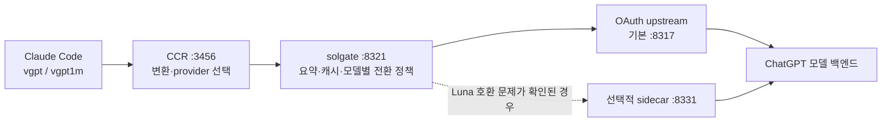

# solgate 설치·운영 가이드

Claude Code에서 GPT-6 Astra와 GPT-5.6 Sol·Terra·Luna를 사용하기 위한 가이드입니다. 모델별 연결 정책과 요약 예산은 [REQUIREMENTS.md](../REQUIREMENTS.md)의 SR1~SR14, 구현 이력은 [BACKLOG.md](BACKLOG.md), 주요 변경은 [CHANGELOG.md](../CHANGELOG.md)에서 관리합니다.

[English overview](../README.md) · [한국어 소개](../README.ko.md)

## Astra 추가 사항

| 항목 | 동작 |
|---|---|
| 일반 세션 | `vgpt astra` → `gpt-6-astra`, 클라이언트에 `--autocompact 220k` 명시 |
| 가상 세션 | `vgpt1m astra` 또는 `vgpt astra1m` → `gpt-6-astra-1m` |
| 메인 응답 | Astra로 유지하며 실패 시 다른 모델로 자동 전환하지 않음 |
| 이전 대화 요약 | Terra → Luna 후보 사용 |
| 가상 요약 예산 | 추정 220k 초과 시 요약, 최근 약 140k 원문 유지, 전송 추정 상한 240k |
| 기존 동작 | 기본 Sol, Opus=Sol·Sonnet=Terra·Haiku=Luna 분담 유지 |

Astra를 고르면 메인 응답을 Astra가 담당합니다. 요약 호출과 Claude Code 작업자는 별도 모델을 사용할 수 있습니다. 따라서 'Astra 고정'은 모든 내부 호출까지 Astra만 사용한다는 뜻은 아닙니다.

이전 대화를 요약하는 가상 1M은 원문 100만 토큰을 한꺼번에 보내거나 보존한다는 의미가 아닙니다. 숫자는 문자 기반 추정 예산이며, 이 OAuth 경로의 Astra 네이티브 최대 문맥을 실측한 결과가 아닙니다.

## 연결 구조



| 구성요소 | 역할 |
|---|---|
| Claude Code CLI | 사용자 대화, 도구 실행, 작업자 호출 |
| 설치판 셸 함수 `install/solgate.zsh` | 모델과 클라이언트 옵션을 정하고 `solgate,<model>` 형식으로 CCR에 요청 |
| claude-code-router (`ccr`) | Anthropic 형식과 OpenAI 형식 변환, solgate provider 선택 |
| solgate `server.mjs` | 가상 모델을 실제 모델에 연결, 이전 대화 요약, 전송 예산 관리, 모델별 자동 전환 |
| VibeProxy 등의 OAuth upstream | 로그인한 계정으로 지원 모델 호출 |
| 선택적 Luna sidecar | 설치기가 지원하는 특정 모델·인증 호환 문제를 감지한 경우에만 별도 연결 제공 |

공개 설치판은 CCR provider prefix를 사용하므로 별도 `custom-router.js` 없이 작동하도록 구성됩니다. 기존 사용자 정의 라우터가 있는 환경은 그 라우터의 우선순위와 Astra 매핑도 확인해야 합니다. cmux는 터미널 작업 공간으로 사용할 수 있으며 설치의 필수 조건은 아닙니다.

## 설치와 업데이트

### 처음 설치

전제조건은 macOS, Node.js 20+, Claude Code CLI, `ccr`, 로그인한 OAuth upstream입니다. 기본 업스트림 주소는 `http://127.0.0.1:8317`입니다. 먼저 upstream의 `/v1/models`에 사용할 모델이 있는지 확인합니다.

```bash
curl http://127.0.0.1:8317/v1/models
git clone https://github.com/VoidLight00/solgate.git
cd solgate
./setup.sh doctor
./setup.sh install
source ~/.zshrc
vgpt astra
```

다른 업스트림 주소를 사용한다면 다음처럼 지정합니다.

```bash
./setup.sh install --upstream http://127.0.0.1:PORT
```

설치 순서는 전제조건 확인 → 필요시 Luna 호환 사이드카 설치 → solgate 서비스 등록 → CCR provider 병합 → 셸 함수 연결 → CCR를 통과하는 소형 요청 확인입니다. 기본 설치의 마지막 응답 검사는 Sol을 사용하므로, 이 결과만으로 Astra까지 검증되었다고 판단하지 않습니다.

서비스 등록은 macOS launchd 전용입니다. 공개 설치기의 label은 `com.solgate.gateway`와 선택적 `com.solgate.sidecar`입니다. 반복 설치를 지원하며 기존 CCR provider를 병합 보존합니다. 기존 CCR 설정이나 업스트림 바이너리를 통째로 삭제하지 않습니다.

### 기존 설치 업데이트

수정 사항이 없는 checkout에서 실행합니다. 로컬 변경이 있다면 먼저 보존한 뒤 병합합니다.

```bash
cd /path/to/solgate
git pull --ff-only
./setup.sh install
source ~/.zshrc
vgpt models
vgpt astra
```

이미 별도 `vgpt`·`vgpt1m` 함수를 운영하는 경우, `.zshrc`에서 나중에 정의되거나 불러온 함수가 우선합니다. 다음 명령으로 실제로 불러온 함수를 확인할 수 있습니다.

```zsh
whence -v vgpt vgpt1m
functions vgpt vgpt1m
```

공개 설치기는 `install/solgate.zsh`를 불러옵니다. 개인 cmux 래퍼·인증 복구 스크립트·별도 모델 라우터는 리포 밖의 사용자 설정이므로 자동 동기화를 가정하지 않습니다. 기존 기능을 유지해야 한다면 설치판의 Astra alias, provider 모델 목록, 명시적 `--autocompact 220k` 동작을 해당 래퍼에도 반영합니다.

### 점검과 제거

```bash
./setup.sh doctor
./setup.sh uninstall
```

`--no-probe`와 `--no-pong`은 각각 업스트림 호환성 확인과 최종 응답 확인을 생략합니다. 사용했다면 해당 검증은 완료되지 않은 상태입니다.

## 사용법

### 세션 시작

```bash
vgpt astra          # 일반 Astra
vgpt1m astra        # 가상 1M Astra
vgpt astra1m        # vgpt1m astra와 동일
vgpt                # 일반 Sol — 기본값 유지
vgpt terra          # 일반 Terra
vgpt luna           # 일반 Luna
vgpt1m              # 가상 1M Sol
vgpt terra1m        # 가상 1M Terra
vgpt luna1m         # 가상 1M Luna
vgpt models         # 설치된 명령 도움말
```

일반 Astra는 `solgate,gpt-6-astra[240k]`와 `--autocompact 220k`를 전달합니다. 사용자 옵션은 그 뒤에 전달합니다. 가상 Astra는 `solgate,gpt-6-astra-1m[1m]`를 사용하며 서버가 대화를 압축합니다.

`[240k]`·`[330k]`·`[1m]`은 클라이언트에 전달하는 라벨입니다. 라벨만 보고 실제 upstream 수용량이나 자동 요약 시점을 보장하지 않습니다. Astra 일반 세션에는 이 때문에 별도의 자동 요약 옵션을 명시합니다.

### 세션 중 모델 전환

```text
/model solgate,gpt-6-astra[240k]
/model solgate,gpt-6-astra-1m[1m]
/model solgate,gpt-5.6-terra-1m[1m]
```

`/model`로 모델을 바꾸는 것과 새 실행 시의 옵션 설정은 별개입니다. 일반 Astra의 명시적 220k 자동 요약 설정까지 적용하려면 `vgpt astra`로 새 세션을 시작합니다.

### 작업자와 모델 선택 슬롯

| Claude Code 별칭 | 일반 세션 | 가상 세션 |
|---|---|---|
| `opus` | Sol | Sol 1M |
| `sonnet` | Terra | Terra 1M |
| `haiku` | Luna | Luna 1M |

커스텀 에이전트의 `model:` 별칭도 같은 설정을 사용합니다. 메인 모델은 `--model`로 따로 지정하므로 Astra를 선택해도 이 분담은 바뀌지 않습니다. Luna는 작은 백그라운드 작업용 `SMALL_FAST` 설정에도 사용됩니다.

## 가상 컨텍스트와 자동 전환

### 모델별 예산

| 가상 모델 | 응답 모델 | 요약 후보 | 요약 시작 추정치 | 최근 원문 유지 목표 | 전송 추정 상한 |
|---|---|---|---:|---:|---:|
| `gpt-6-astra-1m` | Astra | Terra → Luna | 220k 초과 | 약 140k | 240k |
| `gpt-5.6-sol-1m` | Sol | Terra → Luna | 300k 초과 | 약 200k | 330k |
| `gpt-5.6-terra-1m` | Terra | Luna → Sol | 300k 초과 | 약 200k | 330k |
| `gpt-5.6-luna-1m` | Luna | Terra → Sol | 300k 초과 | 약 200k | 330k |

Astra는 자체 예산과 전역 설정 중 작은 값을 각각 적용합니다. 도구 정의의 추정 크기도 전송 상한에서 차감합니다. 요약에는 자신의 응답 모델이나 `*-1m` 가상 모델을 호출하지 않습니다.

문자 기반 추정은 upstream의 실제 토큰 계산과 다르며 출력 예산 등에도 영향을 받습니다. `context_too_large`가 반환되면 직전 전송 추정치의 70%를 새 상한으로 삼아 최대 3회 재압축합니다. 실제 전송 크기가 작아지지 않으면 같은 요청을 반복하지 않고 오류를 반환합니다. `/solgate/stats`의 `ctxRetries`로 확인할 수 있습니다.

### 메인 응답의 전환 정책

| 요청 모델 | 사용량 한도·인증 불가 시 후보 | 정책 |
|---|---|---|
| Astra | 없음 | Astra를 유지하고 오류 표시 |
| Sol | Terra → Luna | 대체 모델을 표시하고 이어서 응답 |
| Terra | 없음 | 명시한 Terra를 유지하고 오류 표시 |
| Luna | Terra → Sol | 대체 모델을 표시하고 이어서 응답 |

이 정책은 일반 모델과 그 가상 모델의 메인 응답에 적용됩니다. 요약 모델 후보는 별도 정책입니다. 자동 전환 시 다음 안내가 응답 첫머리에 붙습니다.

```text
[solgate fallback] gpt-5.6-sol → gpt-5.6-terra (...)
```

모든 후보가 실패하면 오류를 반환합니다. 자동 전환은 구독 한도를 우회하지 않으며, 요약 요청도 upstream 사용량을 소비합니다.

## 상태와 설정

```bash
curl http://127.0.0.1:8321/healthz
curl http://127.0.0.1:8321/v1/models
curl http://127.0.0.1:8321/solgate/stats
tail ~/.solgate/logs/solgate.log
```

주요 통계는 `requests`, `compactions`, `cacheHits`, `fallbacks`, `ctxRetries`, `degraded`입니다. 상태 endpoint가 정상이라는 사실과 모델이 실제로 응답한다는 사실은 따로 확인합니다.

| 환경 변수 | 기본값 | 용도 |
|---|---|---|
| `SOLGATE_PORT` | `8321` | solgate 수신 포트 |
| `SOLGATE_UPSTREAM` | `http://127.0.0.1:8317` | 기본 upstream |
| `SOLGATE_UPSTREAM_LUNA` | 기본 upstream과 동일 | 필요한 경우 Luna만 별도 upstream 사용 |
| `SOLGATE_COMPACT_TRIGGER` | `300000` | 가상 요약 시작 추정치 |
| `SOLGATE_KEEP_RECENT` | `200000` | 최근 원문 유지 목표 |
| `SOLGATE_HARD_CEILING` | `330000` | 가상 요청 전송 추정 상한 |
| `SOLGATE_HOME` | `~/.solgate` | 로컬 데이터 경로 |

Astra profile은 위 문맥 관련 전역 값과 자체 `220000 / 140000 / 240000` 중 각각 작은 값을 사용합니다. 환경 변수를 바꿨다면 실제 서비스를 시작하는 설정에 반영하고 서비스를 다시 시작해야 합니다.

## 검증 범위

```bash
bash gates/ci_gate.sh .
SOLGATE_SKIP_BIG=1 bash gates/verify_solgate.sh .
bash gates/verify_solgate.sh .
```

| 검사 | 확인하는 것 | 확인하지 않는 것 |
|---|---|---|
| Portable CI | 순수 함수, localhost mock, 설치 파일·정적 규칙 | 실제 계정 응답·문맥 수용량 |
| 소형 live 검사 | 실행 중인 서비스를 통한 모델 왕복·스트리밍 | 긴 대화 압축·장기 요약 품질 |
| 대형 live 검사 | Sol profile의 약 330k 압축 시나리오 | Astra 최대 문맥이나 모든 모델의 장문 품질 |

2026-09-05 Astra 추가 시 로컬 mock 38개와 실제 Claude Code의 일반·가상 Astra 파일 읽기 시나리오를 확인했습니다. Astra의 220k 요약 경계·240k 추정 상한·도구 예산 차감·모델 유지 검증은 mock 기반입니다. 이 기록은 전체 live 게이트 통과나 Astra 최대 문맥 검증을 뜻하지 않습니다.

`SOLGATE_SKIP_BIG=1`은 큰 모델 호출을 생략하며 해당 대형 시나리오는 미검증으로 남습니다. Live 검사는 서비스 설정, 계정 접근 권한, 남은 사용량이 필요합니다. CI 배지는 GitHub Actions의 portable 검사 범위만 나타냅니다.

이전 [BACKLOG.md](BACKLOG.md)에 있는 특정 앱 버전과 GPT-5.6 문맥 실측은 당시 환경의 기록입니다. 현재 모든 계정의 사양이나 Astra의 문맥 한도로 일반화하지 않습니다.

## 문제 해결

| 증상 | 확인할 곳 | 조치 |
|---|---|---|
| `vgpt astra`가 unknown model을 반환 | 실제로 불러온 셸 함수 | 업데이트 후 `source ~/.zshrc`; 사용자 정의 함수의 덮어쓰기 여부 확인 |
| upstream 목록에 Astra가 없음 | upstream 버전·카탈로그·계정 접근 | upstream의 공식 업데이트 절차와 계정 모델 목록 확인 후 재시작 |
| 목록에는 있지만 Astra가 다른 모델로 연결됨 | CCR provider와 기존 custom router | `solgate` provider의 Astra ID와 명시적 Astra 경로 확인 |
| `requires a newer version of Codex` | upstream이 사용하는 Codex 클라이언트 정보 | 해당 upstream의 공식 호환성 안내에 따라 업데이트 |
| 특정 모델만 `auth_unavailable` | 해당 모델의 인증·엔진 호환성 | 동일 계정의 지원 모델 확인; 설치기 `doctor`의 호환성 결과 확인 |
| `model_cooldown`·`usage_limit_reached` | 계정 사용량·오류 응답 | 모델별 전환 정책 확인; 사용 가능한 후보가 없으면 한도 갱신 대기 |
| 긴 요청이 `context_too_large`로 실패 | 실제 실행 옵션·도구 정의·전송 예산 | 일반 Astra는 `vgpt astra`로 다시 시작; 가상 경로는 `ctxRetries`와 압축 설정 확인 |
| 가상 세션에서 이전 세부사항 누락 | 요약 결과·`degraded` 통계 | 필요한 세부사항을 파일로 보존하고 다시 제공; 요약을 무손실 보관으로 사용하지 않음 |
| `no such host`인데 `dig`는 정상 | macOS resolver·VPN DNS 설정 | `scutil --dns`, `dscacheutil -q host -a name chatgpt.com`, VPN 상태를 비교 |

문제 보고 시 재현 명령, 모델 ID, 오류 종류, 사용한 버전과 검사 결과를 기록합니다. 토큰·쿠키·Authorization 헤더·원문 대화는 공개 이슈에 붙이지 않습니다.

## 설계 원칙

1. 완료 여부는 실제 응답, 테스트 출력, 게이트 종료코드로 확인합니다.
2. 가상 요청의 추정 상한을 코드로 관리하며 이를 네이티브 최대 창과 혼동하지 않습니다.
3. Astra·Terra는 선택한 메인 모델을 유지하고, Sol·Luna의 대체 모델은 응답에 표시합니다.
4. 앱 바이너리 수정 대신 자체 게이트웨이와 필요한 호환 경로를 사용합니다.
5. 요구사항·실패 기록·변경 이력을 함께 관리합니다.

MIT 라이선스의 독립 프로젝트입니다. 모델 이용 조건과 사용량은 각 upstream 서비스와 계정에 따릅니다.
